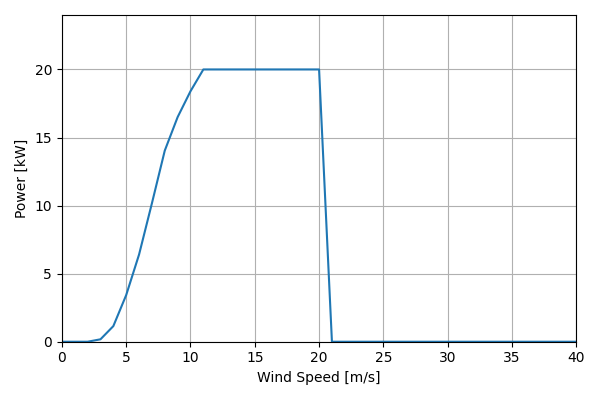
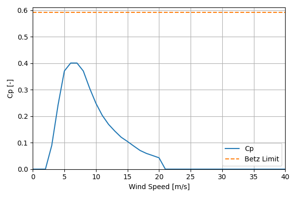

# 2019COE_DW20_20kW_12.4

## Link to CSV File

The .csv file can be found online in the GitHub at [turbine_models/data/Distributed/2019COE_DW20_20kW_12.4.csv](https://github.com/NatLabRockies/turbine-models/tree/main/turbine_models/Distributed/2019COE_DW20_20kW_12.4.csv)

## Key Parameters

This turbine model originates from a NREL’s 2019 Cost of Wind Energy Review {cite:p}`cower_2019`.

| Item               | Value                                  | Units    |
|:-------------------|:---------------------------------------|:---------|
| Name               | 2019_COE_DW_20                         | N/A      |
| Nickname           |                                        | N/A      |
| Rated Power        | 20                                     | kW       |
| Rated Wind Speed   | 11                                     | m/s      |
| Cut-in Wind Speed  | 3                                      | m/s      |
| Cut-out Wind Speed | 20                                     | m/s      |
| Rotor Diameter     | 12.4                                   | m        |
| Hub Height         | 30                                     | m        |
| Drivetrain         |                                        | N/A      |
| Control            |                                        | N/A      |
| IEC Class          |                                        | N/A      |
| Group              | Distributed                            | N/A      |
| Power Curve File   | Distributed/2019COE_DW20_20kW_12.4.csv | N/A      |
| Manufacturer       |                                        | N/A      |
| Origin             | reference model                        | N/A      |
| Power Curve Type   | theoretical                            | N/A      |
| Tip Speed Ratio    |                                        | Unitless |

## Power Curve



## Cp Curve



## References

```{bibliography}
:filter: docname in docnames
:style: unsrt
```
