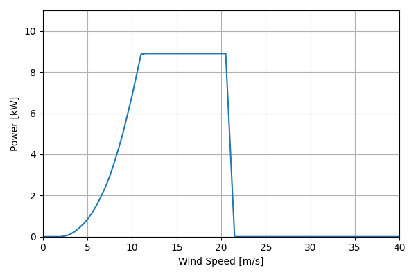
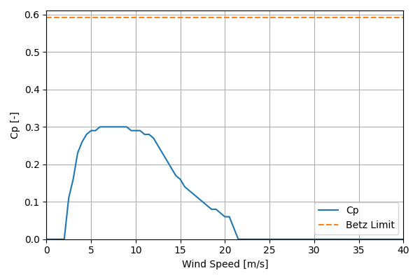

# BergeyExcel10_8.9kW_7

## Link to CSV File

The .csv file can be found online in the GitHub at [turbine_models/data/Distributed/BergeyExcel10_8.9kW_7.csv](https://github.com/NatLabRockies/turbine-models/tree/main/turbine_models/Distributed/BergeyExcel10_8.9kW_7.csv)

## Key Parameters

The performance data comes from a power performance test conducted by the Small Wind Certification
Council (SWCC) {cite:p}`icc_swcc_10_12`. Other information available from the manufacturer
{cite:p}`bergey_excel_10`.

| Item               | Value                                 | Units    |
|:-------------------|:--------------------------------------|:---------|
| Name               | Bergey_Excel_10                       | N/A      |
| Nickname           |                                       | N/A      |
| Rated Power        | 8.9                                   | kW       |
| Rated Wind Speed   | 11                                    | m/s      |
| Cut-in Wind Speed  | 2.5                                   | m/s      |
| Cut-out Wind Speed |                                       | m/s      |
| Rotor Diameter     | 7                                     | m        |
| Hub Height         | [18, 30, 49]                          | m        |
| Drivetrain         | Direct Drive                          | N/A      |
| Control            |                                       | N/A      |
| IEC Class          |                                       | N/A      |
| Group              | Distributed                           | N/A      |
| Power Curve File   | Distributed/BergeyExcel10_8.9kW_7.csv | N/A      |
| Manufacturer       | Bergey                                | N/A      |
| Origin             | commercially available                | N/A      |
| Power Curve Type   | theoretical                           | N/A      |
| Tip Speed Ratio    |                                       | Unitless |

## Power Curve



## Cp Curve



## References

```{bibliography}
:filter: docname in docnames
:style: unsrt
```
