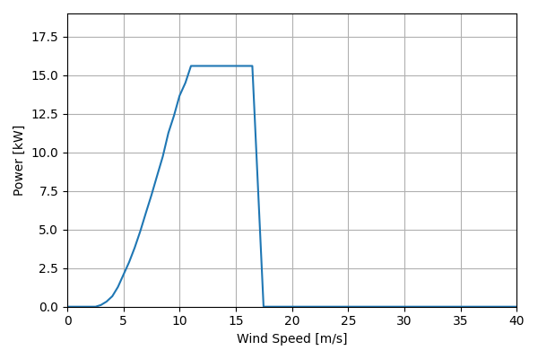
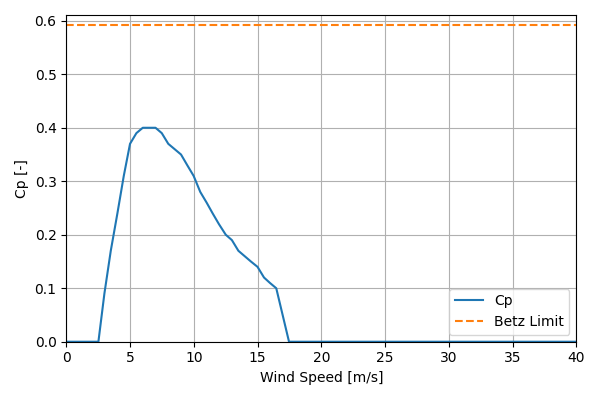

# BergeyExcel15_15.6kW_9.6

## Link to CSV File

The .csv file can be found online in the GitHub at [turbine_models/data/Distributed/BergeyExcel15_15.6kW_9.6.csv](https://github.com/NatLabRockies/turbine-models/tree/main/turbine_models/Distributed/BergeyExcel15_15.6kW_9.6.csv)

## Key Parameters

| Item               | Value                                                                             | Units    |
|:-------------------|:----------------------------------------------------------------------------------|:---------|
| Name               | Bergey_Excel_15                                                                   | N/A      |
| Nickname           |                                                                                   | N/A      |
| Rated Power        | 15.6                                                                              | kW       |
| Rated Wind Speed   | 11                                                                                | m/s      |
| Cut-in Wind Speed  | 2.5                                                                               | m/s      |
| Cut-out Wind Speed |                                                                                   | m/s      |
| Rotor Diameter     | 9.6                                                                               | m        |
| Hub Height         | [18, 24]                                                                          | m        |
| Drivetrain         | Direct Drive                                                                      | N/A      |
| Control            | Stall Regulated                                                                   | N/A      |
| IEC Class          |                                                                                   | N/A      |
| Group              | Distributed                                                                       | N/A      |
| Power Curve File   | Distributed/BergeyExcel15_15.6kW_9.6.csv                                          | N/A      |
| Manufacturer       | Bergey                                                                            | N/A      |
| Origin             | commercially available                                                            | N/A      |
| Power Curve Type   | theoretical                                                                       | N/A      |
| Tip Speed Ratio    |                                                                                   | Unitless |
| Reference Links    | ['https://bergey.com/wp-content/uploads/Excel-15-Tower-Requirements-11-2018.pdf'] | N/A      |

## Power Curve



## Cp Curve



## References


    ```{bibliography}
    :filter: docname in docnames
    ```
    
