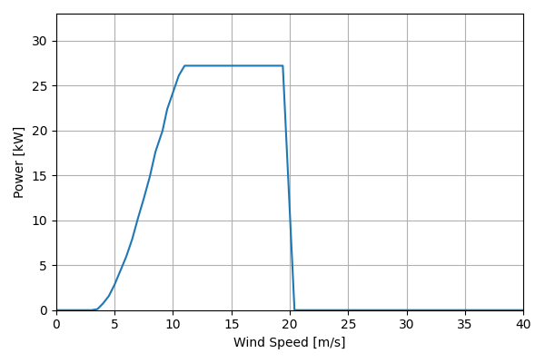
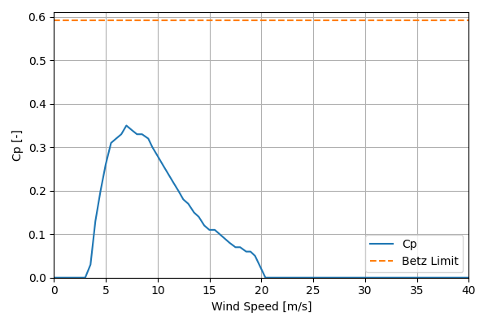

# Bestwind30_27.2kW_13.1

## Link to CSV File

The .csv file can be found online in the GitHub at [turbine_models/data/Distributed/Bestwind30_27.2kW_13.1.csv](https://github.com/NatLabRockies/turbine-models/tree/main/turbine_models/Distributed/Bestwind30_27.2kW_13.1.csv)

## Key Parameters

| Item               | Value                                                                                           | Units    |
|:-------------------|:------------------------------------------------------------------------------------------------|:---------|
| Name               | Bestwind_30                                                                                     | N/A      |
| Nickname           |                                                                                                 | N/A      |
| Rated Power        | 27.2                                                                                            | kW       |
| Rated Wind Speed   | 11                                                                                              | m/s      |
| Cut-in Wind Speed  | 3.5                                                                                             | m/s      |
| Cut-out Wind Speed | 25                                                                                              | m/s      |
| Rotor Diameter     | 13.1                                                                                            | m        |
| Hub Height         | 26.5                                                                                            | m        |
| Drivetrain         | Direct Drive                                                                                    | N/A      |
| Control            | Stall Regulated                                                                                 | N/A      |
| IEC Class          | SWT II                                                                                          | N/A      |
| Group              | Distributed                                                                                     | N/A      |
| Power Curve File   | Distributed/Bestwind30_27.2kW_13.1.csv                                                          | N/A      |
| additional         | {'rotor_tilt': 5, 'rated_rotor_speed': 65}                                                      | nan      |
| Manufacturer       |                                                                                                 | N/A      |
| Origin             | legacy product                                                                                  | N/A      |
| Power Curve Type   | theoretical                                                                                     | N/A      |
| Tip Speed Ratio    |                                                                                                 | Unitless |
| Reference Links    | ['https://smallwindcertification.org/wp-content/uploads/2019/09/Summary-Report-16-02-2019.pdf'] | N/A      |

## Power Curve



## Cp Curve



## References


    ```{bibliography}
    :filter: docname in docnames
    ```
    
