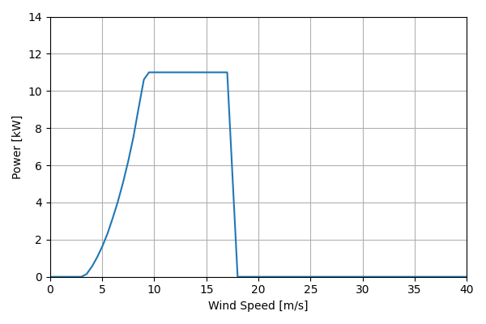
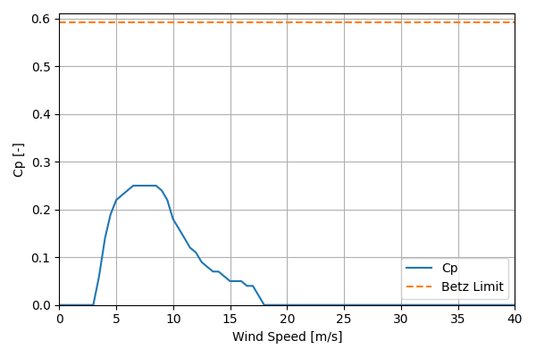

# CF11A_11kW_11.15

## Link to CSV File

The .csv file can be found online in the GitHub at [turbine_models/data/Distributed/CF11A_11kW_11.15.csv](https://github.com/NatLabRockies/turbine-models/tree/main/turbine_models/Distributed/CF11A_11kW_11.15.csv)

## Key Parameters

| Item               | Value                            | Units    |
|:-------------------|:---------------------------------|:---------|
| Name               | CF11A_11kW_11.15                 | N/A      |
| Nickname           |                                  | N/A      |
| Rated Power        | 11                               | kW       |
| Rated Wind Speed   | 9                                | m/s      |
| Cut-in Wind Speed  | 3.5                              | m/s      |
| Cut-out Wind Speed | 25                               | m/s      |
| Rotor Diameter     | 11.15                            | m        |
| Hub Height         | 15.65                            | m        |
| Drivetrain         | Variable Speed                   | N/A      |
| Control            | Pitch Regulated                  | N/A      |
| IEC Class          |                                  | N/A      |
| Group              | Distributed                      | N/A      |
| Power Curve File   | Distributed/CF11A_11kW_11.15.csv | N/A      |
| Manufacturer       |                                  | N/A      |
| Origin             | legacy product                   | N/A      |
| Power Curve Type   | theoretical                      | N/A      |
| Tip Speed Ratio    |                                  | Unitless |

## Power Curve



## Cp Curve



## References

```{bibliography}
:filter: docname in docnames
:style: unsrt
```
