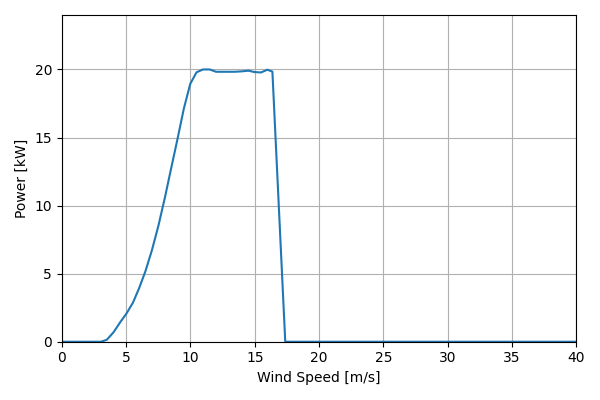
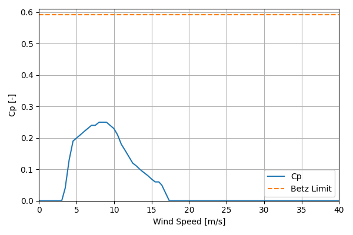

# CF20_20kW_13.1

## Link to CSV File

The .csv file can be found online in the GitHub at [turbine_models/data/Distributed/CF20_20kW_13.1.csv](https://github.com/NatLabRockies/turbine-models/tree/main/turbine_models/Distributed/CF20_20kW_13.1.csv)

## Key Parameters

| Item               | Value                          | Units    |
|:-------------------|:-------------------------------|:---------|
| Name               | CF20                           | N/A      |
| Nickname           |                                | N/A      |
| Rated Power        | 20                             | kW       |
| Rated Wind Speed   | 9                              | m/s      |
| Cut-in Wind Speed  | 3.5                            | m/s      |
| Cut-out Wind Speed | 25                             | m/s      |
| Rotor Diameter     | 13.1                           | m        |
| Hub Height         | 20.1                           | m        |
| Drivetrain         | Variable Speed                 | N/A      |
| Control            | Pitch Regulated                | N/A      |
| IEC Class          | SWT III                        | N/A      |
| Group              | Distributed                    | N/A      |
| Power Curve File   | Distributed/CF20_20kW_13.1.csv | N/A      |
| Manufacturer       |                                | N/A      |
| Origin             | legacy product                 | N/A      |
| Power Curve Type   | theoretical                    | N/A      |
| Tip Speed Ratio    |                                | Unitless |

## Power Curve



## Cp Curve



## References

```{bibliography}
:filter: docname in docnames
:style: unsrt
```
