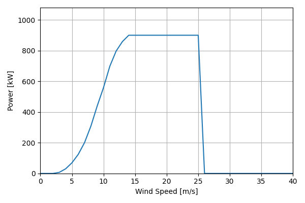
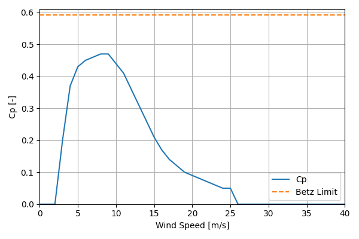

# EWT_DW52_900kW_51.5

## Link to CSV File

The .csv file can be found online in the GitHub at [turbine_models/data/Distributed/EWT_DW52_900kW_51.5.csv](https://github.com/NatLabRockies/turbine-models/tree/main/turbine_models/Distributed/EWT_DW52_900kW_51.5.csv)

## Key Parameters

| Item               | Value                                        | Units    |
|:-------------------|:---------------------------------------------|:---------|
| Name               | EWT_DW52_900kW_51.5                          | N/A      |
| Nickname           |                                              | N/A      |
| Rated Power        | 900                                          | kW       |
| Rated Wind Speed   |                                              | m/s      |
| Cut-in Wind Speed  | 3                                            | m/s      |
| Cut-out Wind Speed | 25                                           | m/s      |
| Rotor Diameter     | 51.5                                         | m        |
| Hub Height         | 40                                           | m        |
| Drivetrain         | direct-drive                                 | N/A      |
| Control            | pitch-controlled                             | N/A      |
| IEC Class          | II-A                                         | N/A      |
| Group              | Distributed                                  | N/A      |
| Power Curve File   | Distributed/EWT_DW52_900kW_51.5.csv          | N/A      |
| Manufacturer       |                                              | N/A      |
| Origin             | commercially available                       | N/A      |
| Power Curve Type   | theoretical                                  | N/A      |
| Tip Speed Ratio    |                                              | Unitless |
| Reference Links    | ['https://ewtdirectwind.com/products/dw52/'] | N/A      |

## Power Curve



## Cp Curve



## References

```{bibliography}
:filter: docname in docnames
:style: unsrt
```
