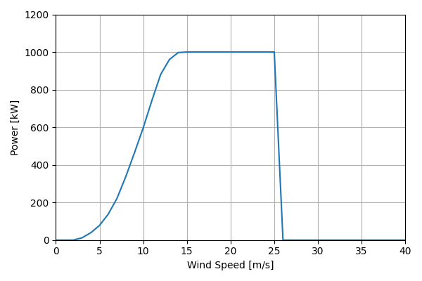
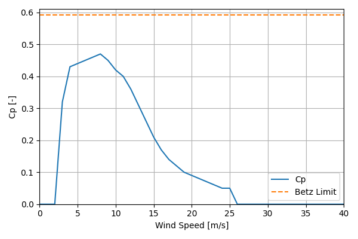

# EWT_DW54X_1MW_54.1

## Link to CSV File

The .csv file can be found online in the GitHub at [turbine_models/data/Distributed/EWT_DW54X_1MW_54.1.csv](https://github.com/NatLabRockies/turbine-models/tree/main/turbine_models/Distributed/EWT_DW54X_1MW_54.1.csv)

## Key Parameters

| Item               | Value                                         | Units    |
|:-------------------|:----------------------------------------------|:---------|
| Name               | EWT_DW54X_1MW_54.1                            | N/A      |
| Nickname           |                                               | N/A      |
| Rated Power        | 1000                                          | kW       |
| Rated Wind Speed   |                                               | m/s      |
| Cut-in Wind Speed  | 3                                             | m/s      |
| Cut-out Wind Speed | 25                                            | m/s      |
| Rotor Diameter     | 54.1                                          | m        |
| Hub Height         | [40.0, 50.0, 59.0]                            | m        |
| Drivetrain         |                                               | N/A      |
| Control            |                                               | N/A      |
| IEC Class          | I-A                                           | N/A      |
| Group              | Distributed                                   | N/A      |
| Power Curve File   | Distributed/EWT_DW54X_1MW_54.1.csv            | N/A      |
| Manufacturer       |                                               | N/A      |
| Origin             | commercially available                        | N/A      |
| Power Curve Type   | theoretical                                   | N/A      |
| Tip Speed Ratio    |                                               | Unitless |
| Reference Links    | ['https://ewtdirectwind.com/products/dw54x/'] | N/A      |

## Power Curve



## Cp Curve



## References

```{bibliography}
:filter: docname in docnames
:style: unsrt
```
