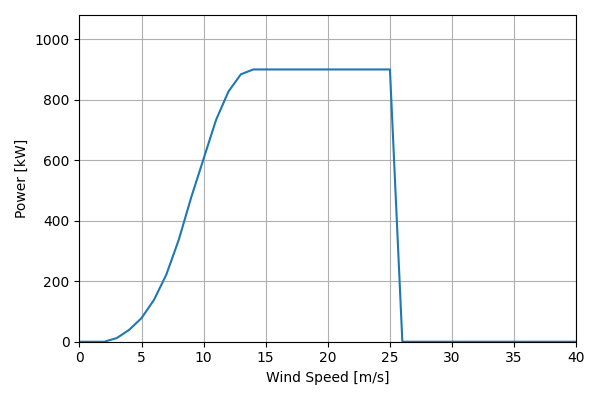
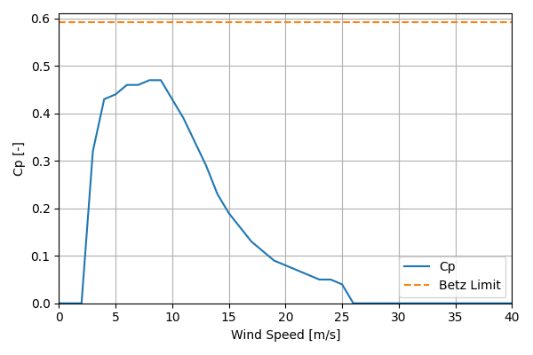

# EWT_DW54_900kW_54

## Link to CSV File

The .csv file can be found online in the GitHub at [turbine_models/data/Distributed/EWT_DW54_900kW_54.csv](https://github.com/NatLabRockies/turbine-models/tree/main/turbine_models/Distributed/EWT_DW54_900kW_54.csv)

## Key Parameters

| Item               | Value                                                                             | Units    |
|:-------------------|:----------------------------------------------------------------------------------|:---------|
| Name               | EWT_DW54_900kW_54                                                                 | N/A      |
| Nickname           |                                                                                   | N/A      |
| Rated Power        | 900                                                                               | kW       |
| Rated Wind Speed   | 13.5                                                                              | m/s      |
| Cut-in Wind Speed  | 2.5                                                                               | m/s      |
| Cut-out Wind Speed | 25                                                                                | m/s      |
| Rotor Diameter     | 54                                                                                | m        |
| Hub Height         | [40.0, 50.0, 75.0]                                                                | m        |
| Drivetrain         | synchronous multi-pole                                                            | N/A      |
| Control            | pitch-controlled                                                                  | N/A      |
| IEC Class          | III-A                                                                             | N/A      |
| Group              | Distributed                                                                       | N/A      |
| Power Curve File   | Distributed/EWT_DW54_900kW_54.csv                                                 | N/A      |
| Manufacturer       |                                                                                   | N/A      |
| Origin             | commercially available                                                            | N/A      |
| Power Curve Type   | theoretical                                                                       | N/A      |
| Tip Speed Ratio    |                                                                                   | Unitless |
| Reference Links    | ['https://ewtdirectwind.com/wp-content/uploads/2018/04/EWT_Flyer-dw54-900kW.pdf'] | N/A      |

## Power Curve



## Cp Curve



## References

```{bibliography}
:filter: docname in docnames
:style: unsrt
```
