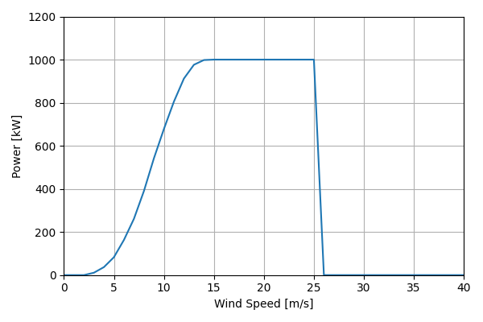
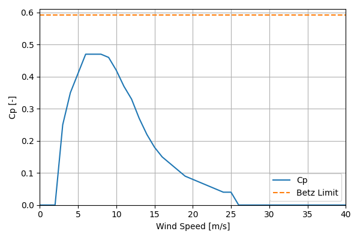

# EWT_DW58_1MW_58

## Link to CSV File

The .csv file can be found online in the GitHub at [turbine_models/data/Distributed/EWT_DW58_1MW_58.csv](https://github.com/NatLabRockies/turbine-models/tree/main/turbine_models/Distributed/EWT_DW58_1MW_58.csv)

## Key Parameters

| Item               | Value                                        | Units    |
|:-------------------|:---------------------------------------------|:---------|
| Name               | EWT_DW58_1MW_58                              | N/A      |
| Nickname           |                                              | N/A      |
| Rated Power        | 1000                                         | kW       |
| Rated Wind Speed   |                                              | m/s      |
| Cut-in Wind Speed  | 3                                            | m/s      |
| Cut-out Wind Speed | 25                                           | m/s      |
| Rotor Diameter     | 58.0                                         | m        |
| Hub Height         | [46.0, 59.0, 69.0, 84.0]                     | m        |
| Drivetrain         |                                              | N/A      |
| Control            |                                              | N/A      |
| IEC Class          | II-A                                         | N/A      |
| Group              | Distributed                                  | N/A      |
| Power Curve File   | Distributed/EWT_DW58_1MW_58.csv              | N/A      |
| Manufacturer       |                                              | N/A      |
| Origin             | commercially available                       | N/A      |
| Power Curve Type   | theoretical                                  | N/A      |
| Tip Speed Ratio    |                                              | Unitless |
| Reference Links    | ['https://ewtdirectwind.com/products/dw58/'] | N/A      |

## Power Curve



## Cp Curve



## References


    ```{bibliography}
    :filter: docname in docnames
    ```
    
