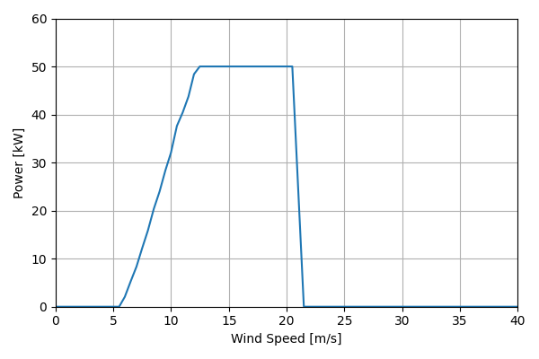
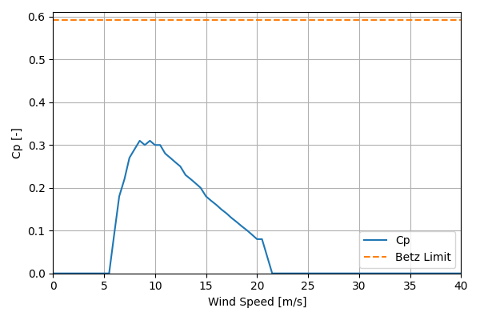

# EntegrityEW50_50kW_15

## Link to CSV File

The .csv file can be found online in the GitHub at [turbine_models/data/Distributed/EntegrityEW50_50kW_15.csv](https://github.com/NatLabRockies/turbine-models/tree/main/turbine_models/Distributed/EntegrityEW50_50kW_15.csv)

## Key Parameters

| Item               | Value                                 | Units    |
|:-------------------|:--------------------------------------|:---------|
| Name               | Entegrity_EW50                        | N/A      |
| Nickname           |                                       | N/A      |
| Rated Power        | 50                                    | kW       |
| Rated Wind Speed   | 11.3                                  | m/s      |
| Cut-in Wind Speed  | 4                                     | m/s      |
| Cut-out Wind Speed | 25                                    | m/s      |
| Rotor Diameter     | 14.9                                  | m        |
| Hub Height         | 31.1                                  | m        |
| Drivetrain         | Variable Speed                        | N/A      |
| Control            | Stall Regulated                       | N/A      |
| IEC Class          |                                       | N/A      |
| Group              | Distributed                           | N/A      |
| Power Curve File   | Distributed/EntegrityEW50_50kW_15.csv | N/A      |
| Manufacturer       |                                       | N/A      |
| Origin             | legacy product                        | N/A      |
| Power Curve Type   | theoretical                           | N/A      |
| Tip Speed Ratio    |                                       | Unitless |

## Power Curve



## Cp Curve



## References

```{bibliography}
:filter: docname in docnames
:style: unsrt
```
