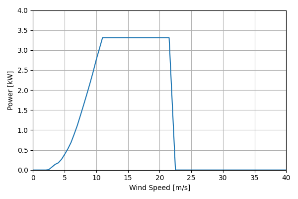
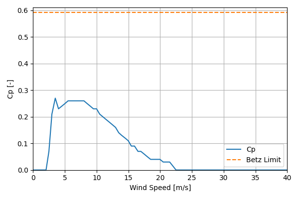

# FortisMontana_3.31kW_5.04

## Link to CSV File

The .csv file can be found online in the GitHub at [turbine_models/data/Distributed/FortisMontana_3.31kW_5.04.csv](https://github.com/NatLabRockies/turbine-models/tree/main/turbine_models/Distributed/FortisMontana_3.31kW_5.04.csv)

## Key Parameters

| Item               | Value                                     | Units    |
|:-------------------|:------------------------------------------|:---------|
| Name               | Fortis_Montana                            | N/A      |
| Nickname           |                                           | N/A      |
| Rated Power        | 3.31                                      | kW       |
| Rated Wind Speed   | 11                                        | m/s      |
| Cut-in Wind Speed  | 2.5                                       | m/s      |
| Cut-out Wind Speed |                                           | m/s      |
| Rotor Diameter     | 5.04                                      | m        |
| Hub Height         | 36.8                                      | m        |
| Drivetrain         | Variable Speed                            | N/A      |
| Control            | Furling (passive)                         | N/A      |
| IEC Class          | SWT II                                    | N/A      |
| Group              | Distributed                               | N/A      |
| Power Curve File   | Distributed/FortisMontana_3.31kW_5.04.csv | N/A      |
| Manufacturer       |                                           | N/A      |
| Origin             | legacy product                            | N/A      |
| Power Curve Type   | theoretical                               | N/A      |
| Tip Speed Ratio    |                                           | Unitless |

## Power Curve



## Cp Curve



## References


    ```{bibliography}
    :filter: docname in docnames
    ```
    
