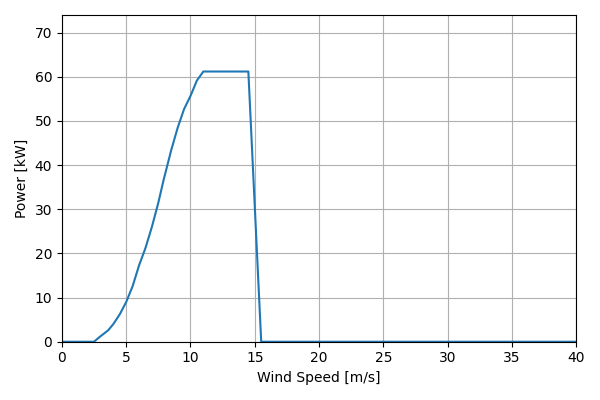
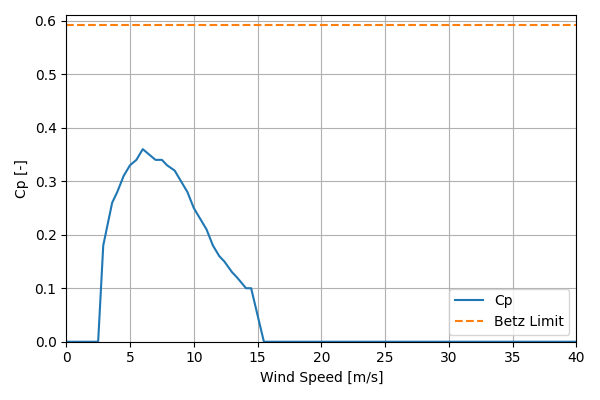

# GhrepowerFD21-50_61.2kW_21.5

## Link to CSV File

The .csv file can be found online in the GitHub at [turbine_models/data/Distributed/GhrepowerFD21-50_61.2kW_21.5.csv](https://github.com/NatLabRockies/turbine-models/tree/main/turbine_models/Distributed/GhrepowerFD21-50_61.2kW_21.5.csv)

## Key Parameters

| Item               | Value                                        | Units    |
|:-------------------|:---------------------------------------------|:---------|
| Name               | FD21-50                                      | N/A      |
| Nickname           |                                              | N/A      |
| Rated Power        | 61.2                                         | kW       |
| Rated Wind Speed   | 11                                           | m/s      |
| Cut-in Wind Speed  | 2.5                                          | m/s      |
| Cut-out Wind Speed | 25                                           | m/s      |
| Rotor Diameter     | 21.5                                         | m        |
| Hub Height         | 36                                           | m        |
| Drivetrain         |                                              | N/A      |
| Control            |                                              | N/A      |
| IEC Class          | II-A                                         | N/A      |
| Group              | Distributed                                  | N/A      |
| Power Curve File   | Distributed/GhrepowerFD21-50_61.2kW_21.5.csv | N/A      |
| Manufacturer       |                                              | N/A      |
| Origin             | legacy product                               | N/A      |
| Power Curve Type   | theoretical                                  | N/A      |
| Tip Speed Ratio    |                                              | Unitless |

## Power Curve



## Cp Curve



## References

```{bibliography}
:filter: docname in docnames
:style: unsrt
```
