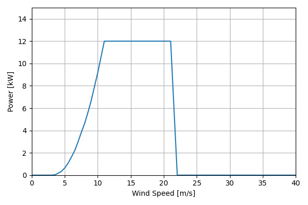
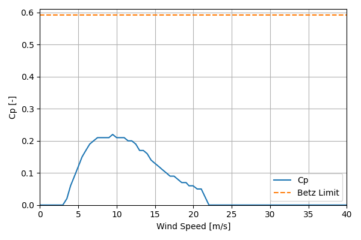

# Jacobs31-20_12kW_9.45

## Link to CSV File

The .csv file can be found online in the GitHub at [turbine_models/data/Distributed/Jacobs31-20_12kW_9.45.csv](https://github.com/NatLabRockies/turbine-models/tree/main/turbine_models/Distributed/Jacobs31-20_12kW_9.45.csv)

## Key Parameters

| Item               | Value                                 | Units    |
|:-------------------|:--------------------------------------|:---------|
| Name               | Jacobs_31-20                          | N/A      |
| Nickname           |                                       | N/A      |
| Rated Power        | 12                                    | kW       |
| Rated Wind Speed   | 11                                    | m/s      |
| Cut-in Wind Speed  | 3.5                                   | m/s      |
| Cut-out Wind Speed |                                       | m/s      |
| Rotor Diameter     | 9.4                                   | m        |
| Hub Height         | 35.9                                  | m        |
| Drivetrain         | Geared                                | N/A      |
| Control            | Passive Pitch Regulation              | N/A      |
| IEC Class          | II                                    | N/A      |
| Group              | Distributed                           | N/A      |
| Power Curve File   | Distributed/Jacobs31-20_12kW_9.45.csv | N/A      |
| Manufacturer       |                                       | N/A      |
| Origin             | legacy product                        | N/A      |
| Power Curve Type   | theoretical                           | N/A      |
| Tip Speed Ratio    |                                       | Unitless |

## Power Curve



## Cp Curve



## References


    ```{bibliography}
    :filter: docname in docnames
    ```
    
