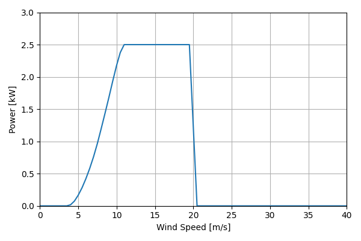
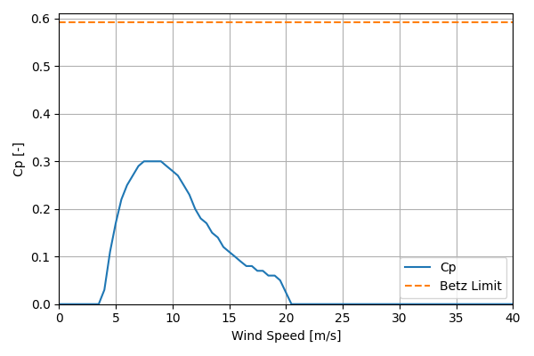

# Kestrele400nb_2.5kW_4

## Link to CSV File

The .csv file can be found online in the GitHub at [turbine_models/data/Distributed/Kestrele400nb_2.5kW_4.csv](https://github.com/NatLabRockies/turbine-models/tree/main/turbine_models/Distributed/Kestrele400nb_2.5kW_4.csv)

## Key Parameters

| Item               | Value                                 | Units    |
|:-------------------|:--------------------------------------|:---------|
| Name               | Kestrel_e400nb                        | N/A      |
| Nickname           |                                       | N/A      |
| Rated Power        | 2.5                                   | kW       |
| Rated Wind Speed   | 11                                    | m/s      |
| Cut-in Wind Speed  | 4                                     | m/s      |
| Cut-out Wind Speed |                                       | m/s      |
| Rotor Diameter     | 4                                     | m        |
| Hub Height         | Varies                                | m        |
| Drivetrain         |                                       | N/A      |
| Control            |                                       | N/A      |
| IEC Class          | II                                    | N/A      |
| Group              | Distributed                           | N/A      |
| Power Curve File   | Distributed/Kestrele400nb_2.5kW_4.csv | N/A      |
| Manufacturer       |                                       | N/A      |
| Origin             | commercially available                | N/A      |
| Power Curve Type   | theoretical                           | N/A      |
| Tip Speed Ratio    |                                       | Unitless |

## Power Curve



## Cp Curve



## References

```{bibliography}
:filter: docname in docnames
:style: unsrt
```
