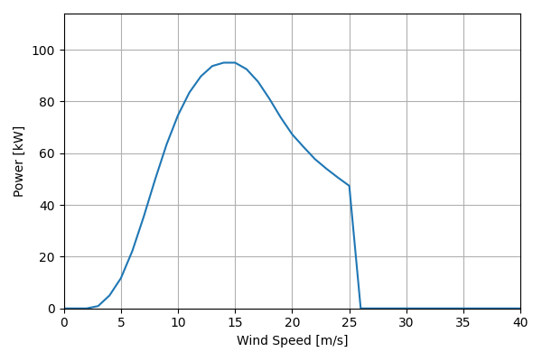
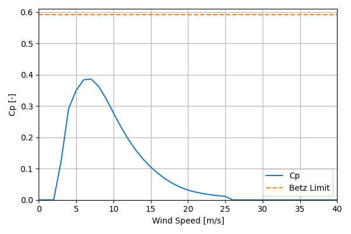

# NPS100B-24_95kW_23.6

## Link to CSV File

The .csv file can be found online in the GitHub at [turbine_models/data/Distributed/NPS100B-24_95kW_23.6.csv](https://github.com/NatLabRockies/turbine-models/tree/main/turbine_models/Distributed/NPS100B-24_95kW_23.6.csv)

## Key Parameters

| Item               | Value                                | Units    |
|:-------------------|:-------------------------------------|:---------|
| Name               | NPS100B-24_95kW_23.6                 | N/A      |
| Nickname           |                                      | N/A      |
| Rated Power        | 95                                   | kW       |
| Rated Wind Speed   | 14.0                                 | m/s      |
| Cut-in Wind Speed  | 3.0                                  | m/s      |
| Cut-out Wind Speed | 25.0                                 | m/s      |
| Rotor Diameter     | 23.6                                 | m        |
| Hub Height         | [30.0, 37.0]                         | m        |
| Drivetrain         | Direct-Drive                         | N/A      |
| Control            |                                      | N/A      |
| IEC Class          | WTGS-III/S                           | N/A      |
| Group              | Distributed                          | N/A      |
| Power Curve File   | Distributed/NPS100B-24_95kW_23.6.csv | N/A      |
| Manufacturer       |                                      | N/A      |
| Origin             | legacy product                       | N/A      |
| Power Curve Type   | theoretical                          | N/A      |
| Tip Speed Ratio    |                                      | Unitless |

## Power Curve



## Cp Curve



## References


    ```{bibliography}
    :filter: docname in docnames
    ```
    
