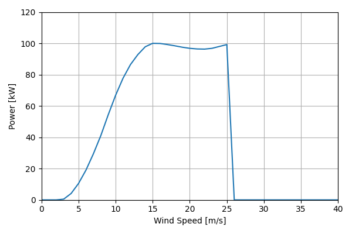
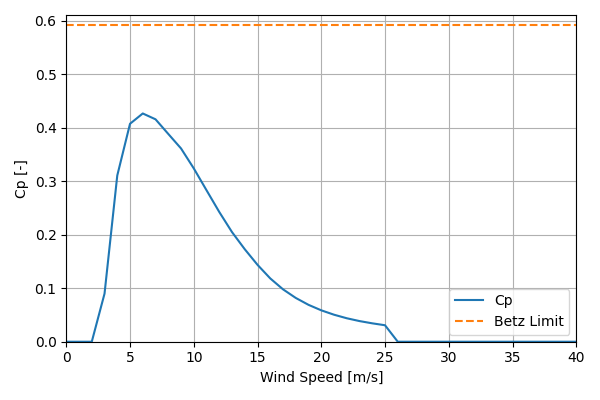

# NPS100C-21_100kW_20.7

## Link to CSV File

The .csv file can be found online in the GitHub at [turbine_models/data/Distributed/NPS100C-21_100kW_20.7.csv](https://github.com/NatLabRockies/turbine-models/tree/main/turbine_models/Distributed/NPS100C-21_100kW_20.7.csv)

## Key Parameters

| Item               | Value                                 | Units    |
|:-------------------|:--------------------------------------|:---------|
| Name               | NPS_100c-21                           | N/A      |
| Nickname           |                                       | N/A      |
| Rated Power        | 100                                   | kW       |
| Rated Wind Speed   | 15                                    | m/s      |
| Cut-in Wind Speed  | 3                                     | m/s      |
| Cut-out Wind Speed | 25                                    | m/s      |
| Rotor Diameter     | 20.7                                  | m        |
| Hub Height         | [19, 22, 37]                          | m        |
| Drivetrain         | Direct                                | N/A      |
| Control            |                                       | N/A      |
| IEC Class          | II-A and II-S                         | N/A      |
| Group              | Distributed                           | N/A      |
| Power Curve File   | Distributed/NPS100C-21_100kW_20.7.csv | N/A      |
| Manufacturer       |                                       | N/A      |
| Origin             | commercially available                | N/A      |
| Power Curve Type   | theoretical                           | N/A      |
| Tip Speed Ratio    |                                       | Unitless |

## Power Curve



## Cp Curve



## References

```{bibliography}
:filter: docname in docnames
:style: unsrt
```
