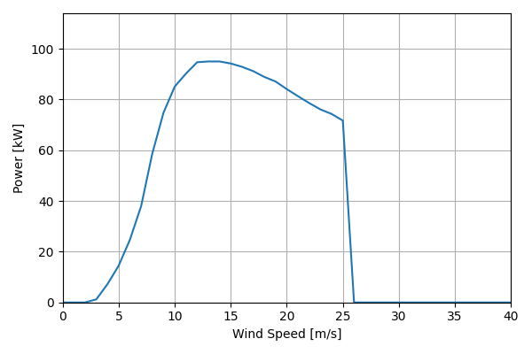
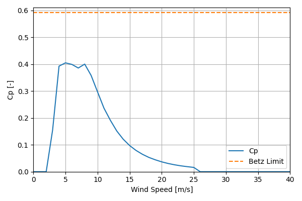

# NPS100C-24_95kW_24.4

## Link to CSV File

The .csv file can be found online in the GitHub at [turbine_models/data/Distributed/NPS100C-24_95kW_24.4.csv](https://github.com/NatLabRockies/turbine-models/tree/main/turbine_models/Distributed/NPS100C-24_95kW_24.4.csv)

## Key Parameters

| Item               | Value                                | Units    |
|:-------------------|:-------------------------------------|:---------|
| Name               | NPS_100C-24                          | N/A      |
| Nickname           |                                      | N/A      |
| Rated Power        | 95                                   | kW       |
| Rated Wind Speed   | 12                                   | m/s      |
| Cut-in Wind Speed  | 3                                    | m/s      |
| Cut-out Wind Speed | 25                                   | m/s      |
| Rotor Diameter     | 24.4                                 | m        |
| Hub Height         | [22, 29, 37]                         | m        |
| Drivetrain         | Direct Drive                         | N/A      |
| Control            | Stall Regulated                      | N/A      |
| IEC Class          | III-A                                | N/A      |
| Group              | Distributed                          | N/A      |
| Power Curve File   | Distributed/NPS100C-24_95kW_24.4.csv | N/A      |
| Manufacturer       |                                      | N/A      |
| Origin             | commercially available               | N/A      |
| Power Curve Type   | theoretical                          | N/A      |
| Tip Speed Ratio    |                                      | Unitless |

## Power Curve



## Cp Curve



## References


    ```{bibliography}
    :filter: docname in docnames
    ```
    
