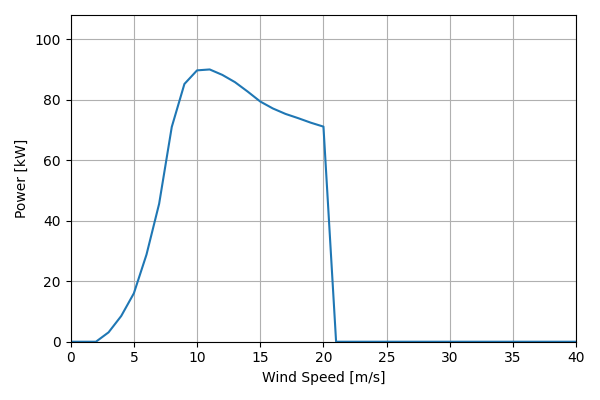
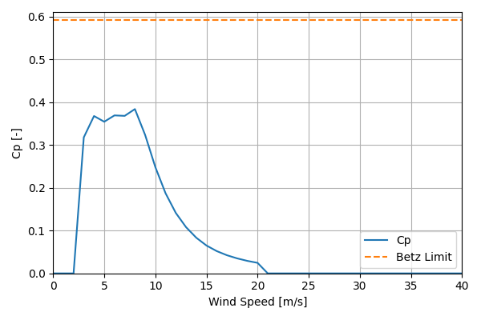

# NPS100C-27_90kW_27.4

## Link to CSV File

The .csv file can be found online in the GitHub at [turbine_models/data/Distributed/NPS100C-27_90kW_27.4.csv](https://github.com/NatLabRockies/turbine-models/tree/main/turbine_models/Distributed/NPS100C-27_90kW_27.4.csv)

## Key Parameters

| Item               | Value                                | Units    |
|:-------------------|:-------------------------------------|:---------|
| Name               | NPS100C-27_90kW_27.4                 | N/A      |
| Nickname           |                                      | N/A      |
| Rated Power        | 90                                   | kW       |
| Rated Wind Speed   | 11                                   | m/s      |
| Cut-in Wind Speed  | 2.5                                  | m/s      |
| Cut-out Wind Speed | 20                                   | m/s      |
| Rotor Diameter     | 27.4                                 | m        |
| Hub Height         | [22.0, 29.0, 37.0]                   | m        |
| Drivetrain         | Direct-Drive                         | N/A      |
| Control            | Variable Speed; stall control        | N/A      |
| IEC Class          | S                                    | N/A      |
| Group              | Distributed                          | N/A      |
| Power Curve File   | Distributed/NPS100C-27_90kW_27.4.csv | N/A      |
| Manufacturer       |                                      | N/A      |
| Origin             | commercially available               | N/A      |
| Power Curve Type   | theoretical                          | N/A      |
| Tip Speed Ratio    |                                      | Unitless |

## Power Curve



## Cp Curve



## References

```{bibliography}
:filter: docname in docnames
:style: unsrt
```
