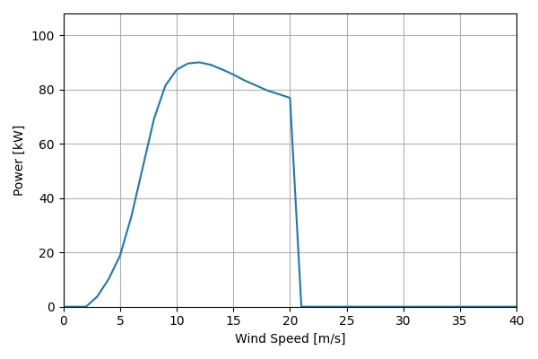
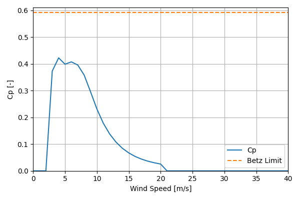

# NPS100C-28_90kW_28

## Link to CSV File

The .csv file can be found online in the GitHub at [turbine_models/data/Distributed/NPS100C-28_90kW_28.csv](https://github.com/NatLabRockies/turbine-models/tree/main/turbine_models/Distributed/NPS100C-28_90kW_28.csv)

## Key Parameters

| Item               | Value                              | Units    |
|:-------------------|:-----------------------------------|:---------|
| Name               | NPS_100C-28                        | N/A      |
| Nickname           |                                    | N/A      |
| Rated Power        | 90                                 | kW       |
| Rated Wind Speed   | 12                                 | m/s      |
| Cut-in Wind Speed  | 2.5                                | m/s      |
| Cut-out Wind Speed | 20                                 | m/s      |
| Rotor Diameter     | 28                                 | m        |
| Hub Height         | [30, 37]                           | m        |
| Drivetrain         | Direct Drive                       | N/A      |
| regulation         |                                    | nan      |
| IEC Class          | Class S                            | N/A      |
| Group              | Distributed                        | N/A      |
| Power Curve File   | Distributed/NPS100C-28_90kW_28.csv | N/A      |
| Manufacturer       |                                    | N/A      |
| Origin             | commercially available             | N/A      |
| Power Curve Type   | theoretical                        | N/A      |
| Tip Speed Ratio    |                                    | Unitless |

## Power Curve



## Cp Curve



## References


    ```{bibliography}
    :filter: docname in docnames
    ```
    
