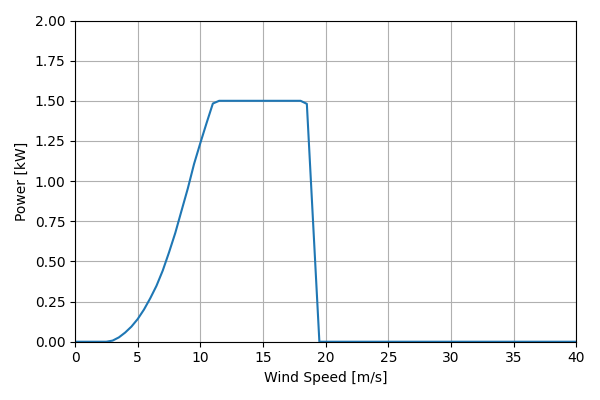
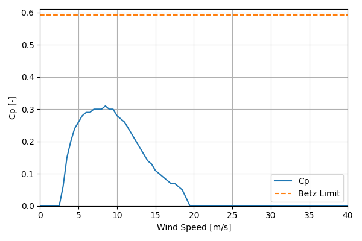

# PikaT701_1.5kW_3

## Link to CSV File

The .csv file can be found online in the GitHub at [turbine_models/data/Distributed/PikaT701_1.5kW_3.csv](https://github.com/NatLabRockies/turbine-models/tree/main/turbine_models/Distributed/PikaT701_1.5kW_3.csv)

## Key Parameters

| Item               | Value                                                                                                                                            | Units    |
|:-------------------|:-------------------------------------------------------------------------------------------------------------------------------------------------|:---------|
| Name               | Pika_T701                                                                                                                                        | N/A      |
| Nickname           |                                                                                                                                                  | N/A      |
| Rated Power        | 1.5                                                                                                                                              | kW       |
| Rated Wind Speed   | 11                                                                                                                                               | m/s      |
| Cut-in Wind Speed  | 3                                                                                                                                                | m/s      |
| Cut-out Wind Speed |                                                                                                                                                  | m/s      |
| Rotor Diameter     | 3                                                                                                                                                | m        |
| Hub Height         | 17                                                                                                                                               | m        |
| Drivetrain         |                                                                                                                                                  | N/A      |
| Control            | Stall Regulated                                                                                                                                  | N/A      |
| IEC Class          | SWT II                                                                                                                                           | N/A      |
| Group              | Distributed                                                                                                                                      | N/A      |
| Power Curve File   | Distributed/PikaT701_1.5kW_3.csv                                                                                                                 | N/A      |
| Manufacturer       |                                                                                                                                                  | N/A      |
| Origin             | legacy product                                                                                                                                   | N/A      |
| Power Curve Type   | theoretical                                                                                                                                      | N/A      |
| Tip Speed Ratio    |                                                                                                                                                  | Unitless |
| Reference Links    | ['https://www.solar-electric.com/lib/wind-sun/Pika_T701_Turbine_Datasheet.pdf?srsltid=AfmBOorPnV2P5Sz27RrAu2B_PqvL6kRDgYZNo9Vm5S34E11cB5TWJns4'] | N/A      |

## Power Curve



## Cp Curve



## References

```{bibliography}
:filter: docname in docnames
:style: unsrt
```
