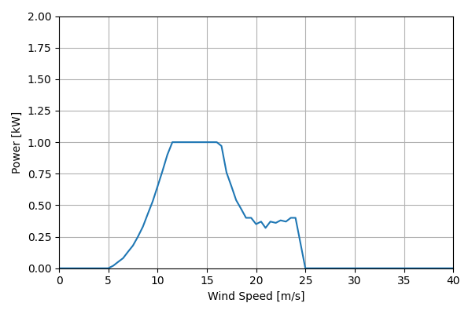
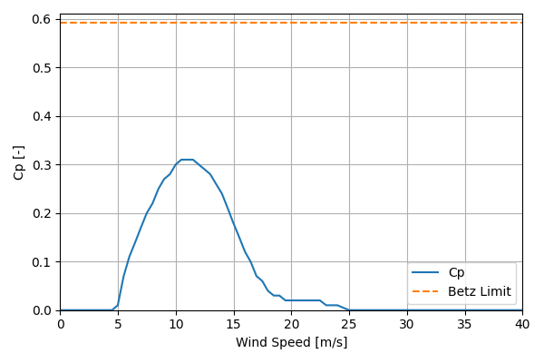

# SWIFT_1kW_2.1

## Link to CSV File

The .csv file can be found online in the GitHub at [turbine_models/data/Distributed/SWIFT_1kW_2.1.csv](https://github.com/NatLabRockies/turbine-models/tree/main/turbine_models/Distributed/SWIFT_1kW_2.1.csv)

## Key Parameters

| Item               | Value                         | Units    |
|:-------------------|:------------------------------|:---------|
| Name               | SWIFT                         | N/A      |
| Nickname           |                               | N/A      |
| Rated Power        | 1                             | kW       |
| Rated Wind Speed   | 11                            | m/s      |
| Cut-in Wind Speed  | 3.4                           | m/s      |
| Cut-out Wind Speed |                               | m/s      |
| Rotor Diameter     | 2.1                           | m        |
| Hub Height         | 14.2                          | m        |
| Drivetrain         |                               | N/A      |
| regulation         | Stall Regulated               | nan      |
| IEC Class          |                               | N/A      |
| Group              | Distributed                   | N/A      |
| Power Curve File   | Distributed/SWIFT_1kW_2.1.csv | N/A      |
| Manufacturer       |                               | N/A      |
| Origin             | legacy product                | N/A      |
| Power Curve Type   | theoretical                   | N/A      |
| Tip Speed Ratio    |                               | Unitless |

## Power Curve



## Cp Curve



## References

```{bibliography}
:filter: docname in docnames
:style: unsrt
```
