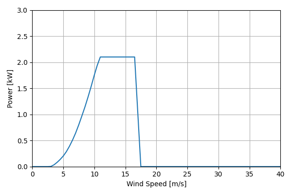
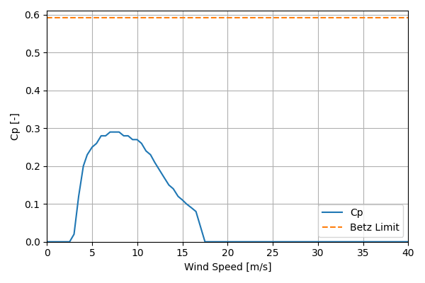

# Skystream3.7_2.1kW_3.7

## Link to CSV File

The .csv file can be found online in the GitHub at [turbine_models/data/Distributed/Skystream3.7_2.1kW_3.7.csv](https://github.com/NatLabRockies/turbine-models/tree/main/turbine_models/Distributed/Skystream3.7_2.1kW_3.7.csv)

## Key Parameters

| Item               | Value                                                                                                                                | Units    |
|:-------------------|:-------------------------------------------------------------------------------------------------------------------------------------|:---------|
| Name               | Skystream_3.7                                                                                                                        | N/A      |
| Nickname           |                                                                                                                                      | N/A      |
| Rated Power        | 2.1                                                                                                                                  | kW       |
| Rated Wind Speed   | 11                                                                                                                                   | m/s      |
| Cut-in Wind Speed  | 3                                                                                                                                    | m/s      |
| Cut-out Wind Speed | 25                                                                                                                                   | m/s      |
| Rotor Diameter     | 3.7                                                                                                                                  | m        |
| Hub Height         | 16                                                                                                                                   | m        |
| Drivetrain         |                                                                                                                                      | N/A      |
| Control            |                                                                                                                                      | N/A      |
| IEC Class          | SWT II                                                                                                                               | N/A      |
| Group              | Distributed                                                                                                                          | N/A      |
| Power Curve File   | Distributed/Skystream3.7_2.1kW_3.7.csv                                                                                               | N/A      |
| Manufacturer       | Wind Resource LLC                                                                                                                    | N/A      |
| Origin             | commercially available                                                                                                               | N/A      |
| Power Curve Type   | theoretical                                                                                                                          | N/A      |
| Tip Speed Ratio    |                                                                                                                                      | Unitless |
| Reference Links    | ['https://skystreamturbines.com', 'https://smallwindcertification.org/wp-content/uploads/2019/07/Summary-Report-10-20-20190709.pdf'] | N/A      |

## Power Curve



## Cp Curve



## References


    ```{bibliography}
    :filter: docname in docnames
    ```
    
