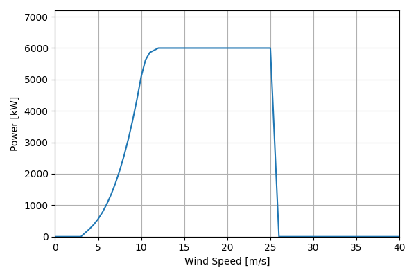
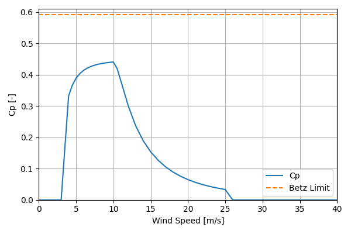

# 2016CACost_NREL_Reference_6MW_155

## Link to CSV File

The .csv file can be found online in the GitHub at [turbine_models/data/Offshore/2016CACost_NREL_Reference_6MW_155.csv](https://github.com/NatLabRockies/turbine-models/tree/main/turbine_models/Offshore/2016CACost_NREL_Reference_6MW_155.csv)

## Key Parameters

| Item               | Value                                          | Units    |
|:-------------------|:-----------------------------------------------|:---------|
| Name               | NREL_Reference_6MW                             | N/A      |
| Nickname           |                                                | N/A      |
| Rated Power        | 6000                                           | kW       |
| Rated Wind Speed   | 12                                             | m/s      |
| Cut-in Wind Speed  | 4                                              | m/s      |
| Cut-out Wind Speed | 25                                             | m/s      |
| Rotor Diameter     | 155                                            | m        |
| Hub Height         | 100                                            | m        |
| Drivetrain         |                                                | N/A      |
| Control            | Pitch Regulated                                | N/A      |
| IEC Class          |                                                | N/A      |
| Group              | Offshore                                       | N/A      |
| Power Curve File   | Offshore/2016CACost_NREL_Reference_6MW_155.csv | N/A      |
| Manufacturer       |                                                | N/A      |
| Origin             | reference model                                | N/A      |
| Power Curve Type   | theoretical                                    | N/A      |
| Tip Speed Ratio    |                                                | Unitless |

## Power Curve



## Cp Curve



## References

```{bibliography}
:filter: docname in docnames
:style: unsrt
```
