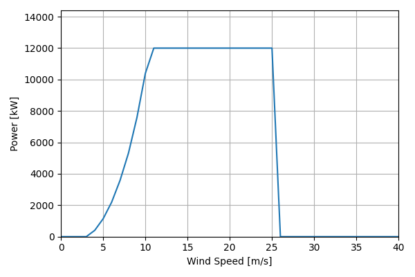
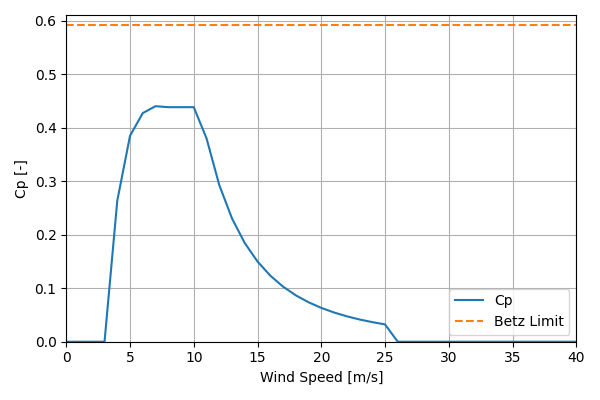

# 2019ORCost_NREL_Reference_12MW_222

## Link to CSV File

The .csv file can be found online in the GitHub at [turbine_models/data/Offshore/2019ORCost_NREL_Reference_12MW_222.csv](https://github.com/NatLabRockies/turbine-models/tree/main/turbine_models/Offshore/2019ORCost_NREL_Reference_12MW_222.csv)

## Key Parameters

| Item               | Value                                           | Units    |
|:-------------------|:------------------------------------------------|:---------|
| Name               | OR_Cost_Reference_12_MW                         | N/A      |
| Nickname           |                                                 | N/A      |
| Rated Power        | 12000                                           | kW       |
| Rated Wind Speed   | 11                                              | m/s      |
| Cut-in Wind Speed  | 3                                               | m/s      |
| Cut-out Wind Speed | 25                                              | m/s      |
| Rotor Diameter     | 222                                             | m        |
| Hub Height         | 136                                             | m        |
| Drivetrain         |                                                 | N/A      |
| Control            |                                                 | N/A      |
| IEC Class          |                                                 | N/A      |
| Group              | Offshore                                        | N/A      |
| Power Curve File   | Offshore/2019ORCost_NREL_Reference_12MW_222.csv | N/A      |
| Manufacturer       |                                                 | N/A      |
| Origin             | reference model                                 | N/A      |
| Power Curve Type   | theoretical                                     | N/A      |
| Tip Speed Ratio    |                                                 | Unitless |

## Power Curve



## Cp Curve



## References


    ```{bibliography}
    :filter: docname in docnames
    ```
    
