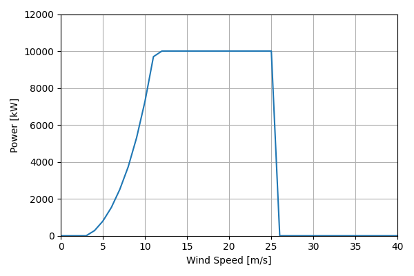
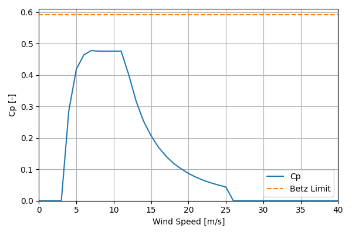

# DTU_Reference_v1_10MW_178

## Link to CSV File

The .csv file can be found online in the GitHub at [turbine_models/data/Offshore/DTU_Reference_v1_10MW_178.csv](https://github.com/NatLabRockies/turbine-models/tree/main/turbine_models/Offshore/DTU_Reference_v1_10MW_178.csv)

## Key Parameters

| Item               | Value                                  | Units    |
|:-------------------|:---------------------------------------|:---------|
| Name               | DTU_Reference_v1_10MW_178              | N/A      |
| Nickname           |                                        | N/A      |
| Rated Power        | 10000                                  | kW       |
| Rated Wind Speed   | 11.4                                   | m/s      |
| Cut-in Wind Speed  | 4                                      | m/s      |
| Cut-out Wind Speed | 25                                     | m/s      |
| Rotor Diameter     | 178.3                                  | m        |
| Hub Height         | 119                                    | m        |
| Drivetrain         | Geared                                 | N/A      |
| Control            | Pitch Regulated                        | N/A      |
| IEC Class          | IA                                     | N/A      |
| Group              | Offshore                               | N/A      |
| Power Curve File   | Offshore/DTU_Reference_v1_10MW_178.csv | N/A      |
| Manufacturer       |                                        | N/A      |
| Origin             | reference model                        | N/A      |
| Power Curve Type   | theoretical                            | N/A      |
| Tip Speed Ratio    |                                        | Unitless |

## Power Curve



## Cp Curve



## References

```{bibliography}
:filter: docname in docnames
:style: unsrt
```
