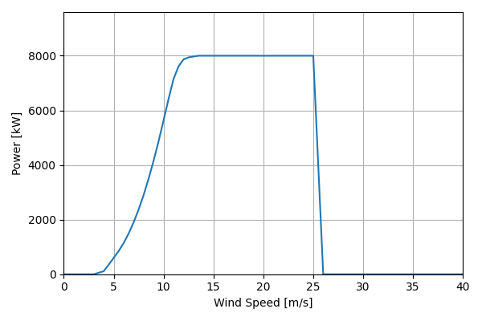
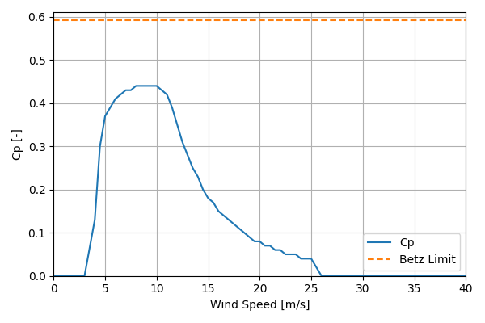

# LEANWIND_Reference_8MW_164

## Link to CSV File

The .csv file can be found online in the GitHub at [turbine_models/data/Offshore/LEANWIND_Reference_8MW_164.csv](https://github.com/NatLabRockies/turbine-models/tree/main/turbine_models/Offshore/LEANWIND_Reference_8MW_164.csv)

## Key Parameters

| Item               | Value                                   | Units    |
|:-------------------|:----------------------------------------|:---------|
| Name               | LEANWIND_Reference_8MW_164              | N/A      |
| Nickname           |                                         | N/A      |
| Rated Power        | 8000                                    | kW       |
| Rated Wind Speed   | 12.5                                    | m/s      |
| Cut-in Wind Speed  | 4                                       | m/s      |
| Cut-out Wind Speed | 25                                      | m/s      |
| Rotor Diameter     | 164                                     | m        |
| Hub Height         | 110                                     | m        |
| Drivetrain         |                                         | N/A      |
| regulation         |                                         | nan      |
| IEC Class          |                                         | N/A      |
| Group              | Offshore                                | N/A      |
| Power Curve File   | Offshore/LEANWIND_Reference_8MW_164.csv | N/A      |
| Manufacturer       |                                         | N/A      |
| Origin             | reference model                         | N/A      |
| Power Curve Type   | theoretical                             | N/A      |
| Tip Speed Ratio    |                                         | Unitless |

## Power Curve



## Cp Curve



## References


    ```{bibliography}
    :filter: docname in docnames
    ```
    
