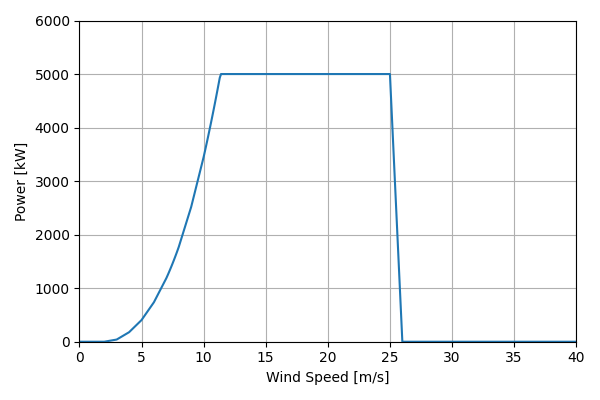
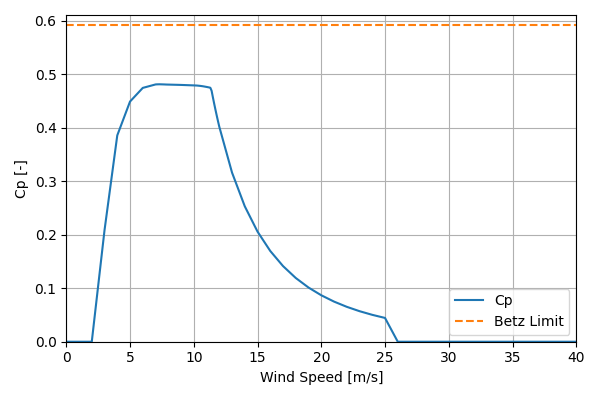

# NREL_Reference_5MW_126

## Link to CSV File

The .csv file can be found online in the GitHub at [turbine_models/data/Offshore/NREL_Reference_5MW_126.csv](https://github.com/NatLabRockies/turbine-models/tree/main/turbine_models/Offshore/NREL_Reference_5MW_126.csv)

## Key Parameters

| Item               | Value                               | Units    |
|:-------------------|:------------------------------------|:---------|
| Name               | NREL_Reference_5MW_126              | N/A      |
| Nickname           |                                     | N/A      |
| Rated Power        | 5000                                | kW       |
| Rated Wind Speed   | 11.4                                | m/s      |
| Cut-in Wind Speed  | 3                                   | m/s      |
| Cut-out Wind Speed | 25                                  | m/s      |
| Rotor Diameter     | 126                                 | m        |
| Hub Height         | 90                                  | m        |
| Drivetrain         | Geared                              | N/A      |
| Control            | Pitch Regulated                     | N/A      |
| IEC Class          |                                     | N/A      |
| Group              | Offshore                            | N/A      |
| Power Curve File   | Offshore/NREL_Reference_5MW_126.csv | N/A      |
| Manufacturer       |                                     | N/A      |
| Origin             | reference model                     | N/A      |
| Power Curve Type   | theoretical                         | N/A      |
| Tip Speed Ratio    |                                     | Unitless |

## Power Curve



## Cp Curve



## References


    ```{bibliography}
    :filter: docname in docnames
    ```
    
