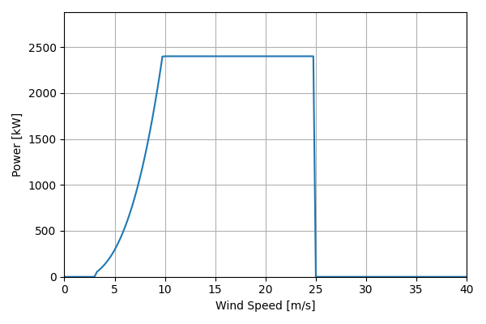
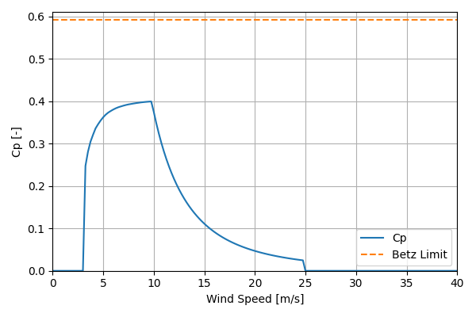

# 2018COE_Market_Average_2.4MW_116

## Link to CSV File

The .csv file can be found online in the GitHub at [turbine_models/data/Onshore/2018COE_Market_Average_2.4MW_116.csv](https://github.com/NatLabRockies/turbine-models/tree/main/turbine_models/Onshore/2018COE_Market_Average_2.4MW_116.csv)

## Key Parameters

| Item               | Value                                        | Units    |
|:-------------------|:---------------------------------------------|:---------|
| Name               | 2018_COE_Market_Average                      | N/A      |
| Nickname           |                                              | N/A      |
| Rated Power        | 2400                                         | kW       |
| Rated Wind Speed   |                                              | m/s      |
| Cut-in Wind Speed  | 3                                            | m/s      |
| Cut-out Wind Speed | 25                                           | m/s      |
| Rotor Diameter     | 116                                          | m        |
| Hub Height         | 88                                           | m        |
| Drivetrain         | Geared                                       | N/A      |
| Control            |                                              | N/A      |
| IEC Class          |                                              | N/A      |
| Group              | Onshore                                      | N/A      |
| Power Curve File   | Onshore/2018COE_Market_Average_2.4MW_116.csv | N/A      |
| Manufacturer       |                                              | N/A      |
| Origin             | reference model                              | N/A      |
| Power Curve Type   | theoretical                                  | N/A      |
| Tip Speed Ratio    |                                              | Unitless |

## Power Curve



## Cp Curve



## References

```{bibliography}
:filter: docname in docnames
:style: unsrt
```
