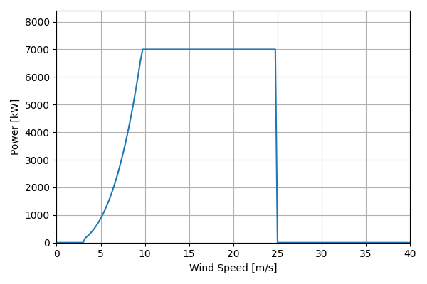
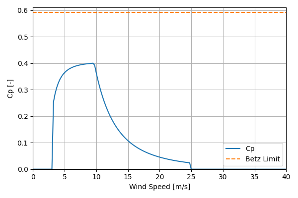

# 2020ATB_NREL_Reference_7MW_200

## Link to CSV File

The .csv file can be found online in the GitHub at [turbine_models/data/Onshore/2020ATB_NREL_Reference_7MW_200.csv](https://github.com/NatLabRockies/turbine-models/tree/main/turbine_models/Onshore/2020ATB_NREL_Reference_7MW_200.csv)

## Key Parameters

| Item               | Value                                      | Units    |
|:-------------------|:-------------------------------------------|:---------|
| Name               | 2020_ATB_NREL_Reference_7_MW               | N/A      |
| Nickname           |                                            | N/A      |
| Rated Power        | 7000                                       | kW       |
| Rated Wind Speed   | 9.75                                       | m/s      |
| Cut-in Wind Speed  | 3.25                                       | m/s      |
| Cut-out Wind Speed | 25                                         | m/s      |
| Rotor Diameter     | 200                                        | m        |
| Hub Height         | 175                                        | m        |
| Drivetrain         |                                            | N/A      |
| Control            |                                            | N/A      |
| IEC Class          |                                            | N/A      |
| Group              | Onshore                                    | N/A      |
| Power Curve File   | Onshore/2020ATB_NREL_Reference_7MW_200.csv | N/A      |
| Manufacturer       |                                            | N/A      |
| Origin             | reference model                            | N/A      |
| Power Curve Type   | theoretical                                | N/A      |
| Tip Speed Ratio    |                                            | Unitless |

## Power Curve



## Cp Curve



## References


    ```{bibliography}
    :filter: docname in docnames
    ```
    
