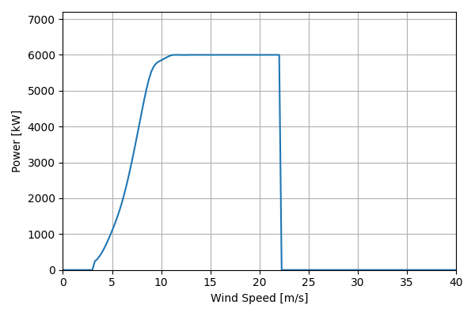
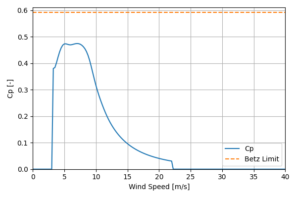

# 2023NREL_Bespoke_6MW_196

## Link to CSV File

The .csv file can be found online in the GitHub at [turbine_models/data/Onshore/2023NREL_Bespoke_6MW_196.csv](https://github.com/NatLabRockies/turbine-models/tree/main/turbine_models/Onshore/2023NREL_Bespoke_6MW_196.csv)

## Key Parameters

| Item               | Value                                | Units    |
|:-------------------|:-------------------------------------|:---------|
| Name               | 2023NREL_Bespoke_6MW_196             | N/A      |
| Nickname           |                                      | N/A      |
| Rated Power        | 6000                                 | kW       |
| Rated Wind Speed   |                                      | m/s      |
| Cut-in Wind Speed  |                                      | m/s      |
| Cut-out Wind Speed |                                      | m/s      |
| Rotor Diameter     | 196                                  | m        |
| Hub Height         | 140                                  | m        |
| Drivetrain         |                                      | N/A      |
| Control            |                                      | N/A      |
| IEC Class          |                                      | N/A      |
| Group              | Onshore                              | N/A      |
| Power Curve File   | Onshore/2023NREL_Bespoke_6MW_196.csv | N/A      |
| turbine_class      | T4                                   | nan      |
| Manufacturer       |                                      | N/A      |
| Origin             | reference model                      | N/A      |
| Power Curve Type   | theoretical                          | N/A      |
| Tip Speed Ratio    |                                      | Unitless |

## Power Curve



## Cp Curve



## References


    ```{bibliography}
    :filter: docname in docnames
    ```
    
