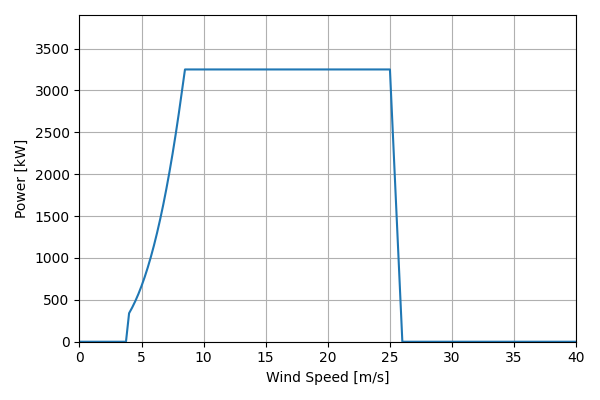
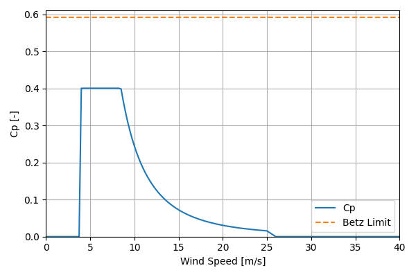

# BAR_BAU_LowSP_3.25MW_166

## Link to CSV File

The .csv file can be found online in the GitHub at [turbine_models/data/Onshore/BAR_BAU_LowSP_3.25MW_166.csv](https://github.com/NatLabRockies/turbine-models/tree/main/turbine_models/Onshore/BAR_BAU_LowSP_3.25MW_166.csv)

## Key Parameters

| Item               | Value                                | Units    |
|:-------------------|:-------------------------------------|:---------|
| Name               | BAR_BAU_LowSP_3.25MW                 | N/A      |
| Nickname           |                                      | N/A      |
| Rated Power        | 3250                                 | kW       |
| Rated Wind Speed   | 8.5                                  | m/s      |
| Cut-in Wind Speed  | 4                                    | m/s      |
| Cut-out Wind Speed | 25                                   | m/s      |
| Rotor Diameter     | 166                                  | m        |
| Hub Height         | 116                                  | m        |
| Drivetrain         |                                      | N/A      |
| Control            |                                      | N/A      |
| IEC Class          |                                      | N/A      |
| Group              | Onshore                              | N/A      |
| Power Curve File   | Onshore/BAR_BAU_LowSP_3.25MW_166.csv | N/A      |
| Manufacturer       |                                      | N/A      |
| Origin             |                                      | N/A      |
| Power Curve Type   | theoretical                          | N/A      |
| Tip Speed Ratio    |                                      | Unitless |

## Power Curve



## Cp Curve



## References

```{bibliography}
:filter: docname in docnames
:style: unsrt
```
