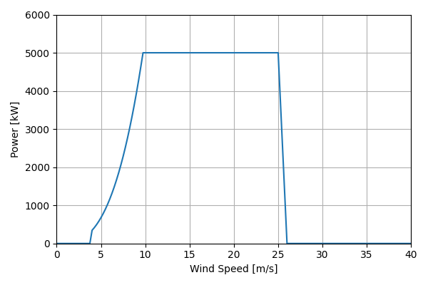
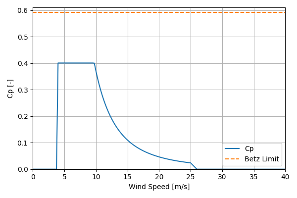

# BAR_BAUa_5.0MW_167.4

## Link to CSV File

The .csv file can be found online in the GitHub at [turbine_models/data/Onshore/BAR_BAUa_5.0MW_167.4.csv](https://github.com/NatLabRockies/turbine-models/tree/main/turbine_models/Onshore/BAR_BAUa_5.0MW_167.4.csv)

## Key Parameters

| Item               | Value                            | Units    |
|:-------------------|:---------------------------------|:---------|
| Name               | BAR_BAUa_5MW                     | N/A      |
| Nickname           |                                  | N/A      |
| Rated Power        | 5000                             | kW       |
| Rated Wind Speed   | 9.75                             | m/s      |
| Cut-in Wind Speed  | 4                                | m/s      |
| Cut-out Wind Speed | 25                               | m/s      |
| Rotor Diameter     | 167.4                            | m        |
| Hub Height         | 117                              | m        |
| Drivetrain         |                                  | N/A      |
| Control            |                                  | N/A      |
| IEC Class          |                                  | N/A      |
| Group              | Onshore                          | N/A      |
| Power Curve File   | Onshore/BAR_BAUa_5.0MW_167.4.csv | N/A      |
| Manufacturer       |                                  | N/A      |
| Origin             |                                  | N/A      |
| Power Curve Type   | theoretical                      | N/A      |
| Tip Speed Ratio    |                                  | Unitless |

## Power Curve



## Cp Curve



## References

```{bibliography}
:filter: docname in docnames
:style: unsrt
```
