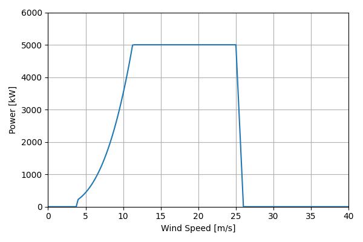
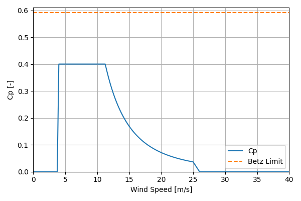

# BAR_HighSP_5.0MW_134.9

## Link to CSV File

The .csv file can be found online in the GitHub at [turbine_models/data/Onshore/BAR_HighSP_5.0MW_134.9.csv](https://github.com/NatLabRockies/turbine-models/tree/main/turbine_models/Onshore/BAR_HighSP_5.0MW_134.9.csv)

## Key Parameters

| Item               | Value                              | Units    |
|:-------------------|:-----------------------------------|:---------|
| Name               | BAR_HighSP_5MW                     | N/A      |
| Nickname           |                                    | N/A      |
| Rated Power        | 5000                               | kW       |
| Rated Wind Speed   | 11.25                              | m/s      |
| Cut-in Wind Speed  | 4                                  | m/s      |
| Cut-out Wind Speed | 25                                 | m/s      |
| Rotor Diameter     | 135                                | m        |
| Hub Height         | 100                                | m        |
| Drivetrain         |                                    | N/A      |
| Control            |                                    | N/A      |
| IEC Class          |                                    | N/A      |
| Group              | Onshore                            | N/A      |
| Power Curve File   | Onshore/BAR_HighSP_5.0MW_134.9.csv | N/A      |
| Manufacturer       |                                    | N/A      |
| Origin             |                                    | N/A      |
| Power Curve Type   | theoretical                        | N/A      |
| Tip Speed Ratio    |                                    | Unitless |

## Power Curve



## Cp Curve



## References


    ```{bibliography}
    :filter: docname in docnames
    ```
    
