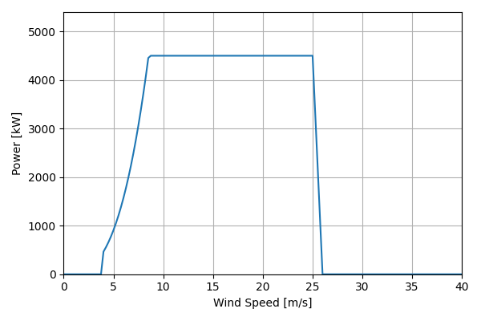
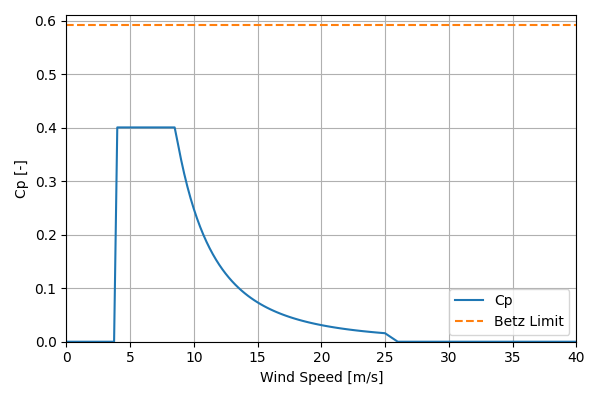

# BAR_LowSP_4.5MW_194

## Link to CSV File

The .csv file can be found online in the GitHub at [turbine_models/data/Onshore/BAR_LowSP_4.5MW_194.csv](https://github.com/NatLabRockies/turbine-models/tree/main/turbine_models/Onshore/BAR_LowSP_4.5MW_194.csv)

## Key Parameters

| Item               | Value                           | Units    |
|:-------------------|:--------------------------------|:---------|
| Name               | BAR_LowSP_4.5MW                 | N/A      |
| Nickname           |                                 | N/A      |
| Rated Power        | 4500                            | kW       |
| Rated Wind Speed   | 8.5                             | m/s      |
| Cut-in Wind Speed  | 4                               | m/s      |
| Cut-out Wind Speed | 25                              | m/s      |
| Rotor Diameter     | 194                             | m        |
| Hub Height         | 130                             | m        |
| Drivetrain         |                                 | N/A      |
| Control            |                                 | N/A      |
| IEC Class          |                                 | N/A      |
| Group              | Onshore                         | N/A      |
| Power Curve File   | Onshore/BAR_LowSP_4.5MW_194.csv | N/A      |
| Manufacturer       |                                 | N/A      |
| Origin             |                                 | N/A      |
| Power Curve Type   | theoretical                     | N/A      |
| Tip Speed Ratio    |                                 | Unitless |

## Power Curve



## Cp Curve



## References


    ```{bibliography}
    :filter: docname in docnames
    ```
    
