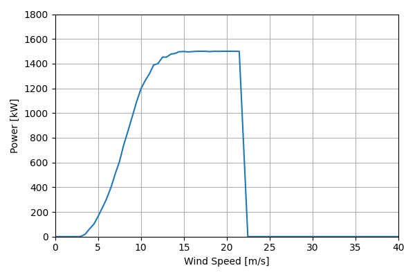
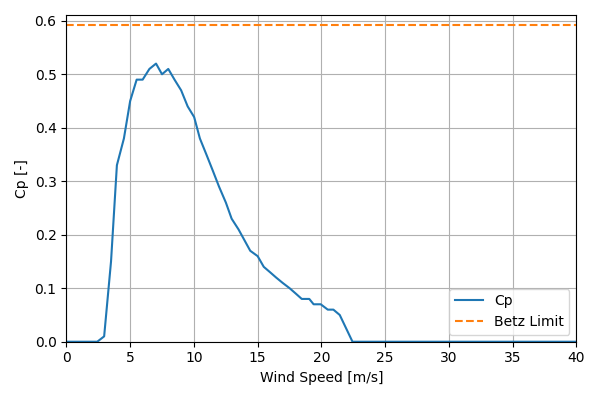

# DOE_GE_1.5MW_77

## Link to CSV File

The .csv file can be found online in the GitHub at [turbine_models/data/Onshore/DOE_GE_1.5MW_77.csv](https://github.com/NatLabRockies/turbine-models/tree/main/turbine_models/Onshore/DOE_GE_1.5MW_77.csv)

## Key Parameters

| Item               | Value                       | Units    |
|:-------------------|:----------------------------|:---------|
| Name               | DOE_GE_1.5_MW               | N/A      |
| Nickname           |                             | N/A      |
| Rated Power        | 1500                        | kW       |
| Rated Wind Speed   | 14.5                        | m/s      |
| Cut-in Wind Speed  | 3.5                         | m/s      |
| Cut-out Wind Speed | 25                          | m/s      |
| Rotor Diameter     | 77                          | m        |
| Hub Height         | 80                          | m        |
| Drivetrain         | Geared                      | N/A      |
| Control            | Pitch Regulated             | N/A      |
| IEC Class          | IIa                         | N/A      |
| Group              | Onshore                     | N/A      |
| Power Curve File   | Onshore/DOE_GE_1.5MW_77.csv | N/A      |
| Manufacturer       |                             | N/A      |
| Origin             |                             | N/A      |
| Power Curve Type   | theoretical                 | N/A      |
| Tip Speed Ratio    |                             | Unitless |

## Power Curve



## Cp Curve



## References

```{bibliography}
:filter: docname in docnames
:style: unsrt
```
