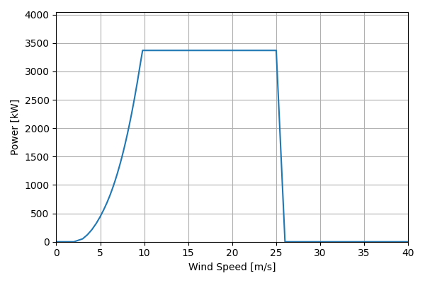
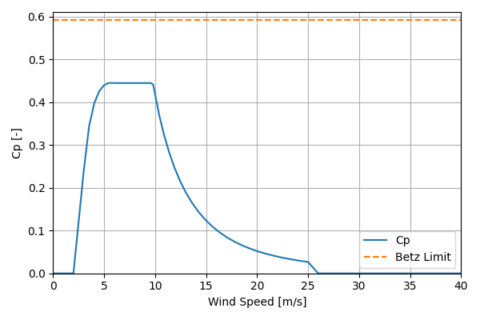

# IEA_Reference_3.4MW_130

## Link to CSV File

The .csv file can be found online in the GitHub at [turbine_models/data/Onshore/IEA_Reference_3.4MW_130.csv](https://github.com/NatLabRockies/turbine-models/tree/main/turbine_models/Onshore/IEA_Reference_3.4MW_130.csv)

## Key Parameters

| Item               | Value                               | Units    |
|:-------------------|:------------------------------------|:---------|
| Name               | IEA_Reference_3.4MW_130             | N/A      |
| Nickname           |                                     | N/A      |
| Rated Power        | 3370                                | kW       |
| Rated Wind Speed   | 9.8                                 | m/s      |
| Cut-in Wind Speed  | 4                                   | m/s      |
| Cut-out Wind Speed | 25                                  | m/s      |
| Rotor Diameter     | 130                                 | m        |
| Hub Height         | 110                                 | m        |
| Drivetrain         | Geared                              | N/A      |
| Control            | Pitch Regulated                     | N/A      |
| IEC Class          | IIIa                                | N/A      |
| Group              | Onshore                             | N/A      |
| Power Curve File   | Onshore/IEA_Reference_3.4MW_130.csv | N/A      |
| Manufacturer       |                                     | N/A      |
| Origin             | reference model                     | N/A      |
| Power Curve Type   | theoretical                         | N/A      |
| Tip Speed Ratio    |                                     | Unitless |

## Power Curve



## Cp Curve



## References

```{bibliography}
:filter: docname in docnames
:style: unsrt
```
