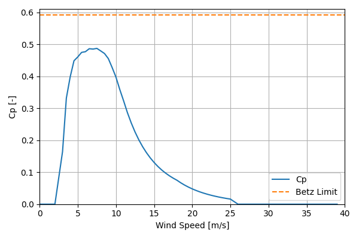

# IEC_Class2_Normalized_Industry_Composite

## Link to CSV File

The .csv file can be found online in the GitHub at [turbine_models/data/Onshore/IEC_Class2_Normalized_Industry_Composite.csv](https://github.com/NatLabRockies/turbine-models/tree/main/turbine_models/Onshore/IEC_Class2_Normalized_Industry_Composite.csv)

## Key Parameters

| Item               | Value                                                | Units    |
|:-------------------|:-----------------------------------------------------|:---------|
| Name               | IEC_Class_2_Composite                                | N/A      |
| Nickname           |                                                      | N/A      |
| Rated Power        |                                                      | kW       |
| Rated Wind Speed   |                                                      | m/s      |
| Cut-in Wind Speed  |                                                      | m/s      |
| Cut-out Wind Speed |                                                      | m/s      |
| Rotor Diameter     |                                                      | m        |
| Hub Height         |                                                      | m        |
| Drivetrain         |                                                      | N/A      |
| Control            |                                                      | N/A      |
| IEC Class          | II                                                   | N/A      |
| Group              | Onshore                                              | N/A      |
| Power Curve File   | Onshore/IEC_Class2_Normalized_Industry_Composite.csv | N/A      |
| Manufacturer       |                                                      | N/A      |
| Origin             | reference model                                      | N/A      |
| Power Curve Type   | theoretical                                          | N/A      |
| Tip Speed Ratio    |                                                      | Unitless |

## Power Curve


## Cp Curve



## References


    ```{bibliography}
    :filter: docname in docnames
    ```
    
