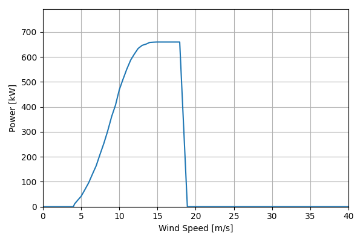
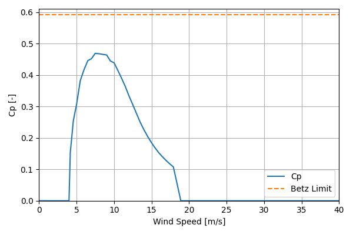

# VestasV47_660kW_47

## Link to CSV File

The .csv file can be found online in the GitHub at [turbine_models/data/Onshore/VestasV47_660kW_47.csv](https://github.com/NatLabRockies/turbine-models/tree/main/turbine_models/Onshore/VestasV47_660kW_47.csv)

## Key Parameters

| Item               | Value                          | Units    |
|:-------------------|:-------------------------------|:---------|
| Name               | Vestas_V47                     | N/A      |
| Nickname           |                                | N/A      |
| Rated Power        | 660                            | kW       |
| Rated Wind Speed   | 15                             | m/s      |
| Cut-in Wind Speed  | 4                              | m/s      |
| Cut-out Wind Speed | 25                             | m/s      |
| Rotor Diameter     | 47                             | m        |
| Hub Height         | [45, 50, 55, 60, 65]           | m        |
| Drivetrain         | Geared                         | N/A      |
| Control            | Pitch Regulated                | N/A      |
| IEC Class          |                                | N/A      |
| Group              | Onshore                        | N/A      |
| Power Curve File   | Onshore/VestasV47_660kW_47.csv | N/A      |
| Manufacturer       |                                | N/A      |
| Origin             |                                | N/A      |
| Power Curve Type   | theoretical                    | N/A      |
| Tip Speed Ratio    |                                | Unitless |

## Power Curve



## Cp Curve



## References


    ```{bibliography}
    :filter: docname in docnames
    ```
    
