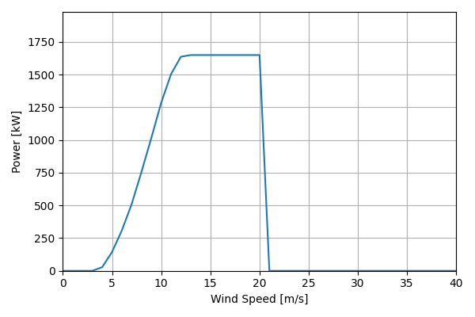
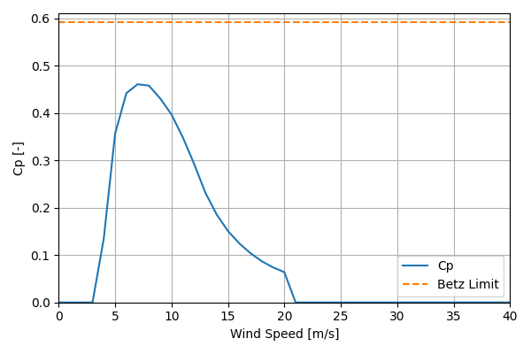

# VestasV82_1.65MW_82

## Link to CSV File

The .csv file can be found online in the GitHub at [turbine_models/data/Onshore/VestasV82_1.65MW_82.csv](https://github.com/NatLabRockies/turbine-models/tree/main/turbine_models/Onshore/VestasV82_1.65MW_82.csv)

## Key Parameters

| Item               | Value                           | Units    |
|:-------------------|:--------------------------------|:---------|
| Name               | Vestas_V82                      | N/A      |
| Nickname           |                                 | N/A      |
| Rated Power        | 1650                            | kW       |
| Rated Wind Speed   | 13                              | m/s      |
| Cut-in Wind Speed  | 3.5                             | m/s      |
| Cut-out Wind Speed | 20                              | m/s      |
| Rotor Diameter     | 82                              | m        |
| Hub Height         | [59, 68.5, 70, 78, 80]          | m        |
| Drivetrain         | Geared                          | N/A      |
| Control            | Active Stall                    | N/A      |
| IEC Class          | IIb                             | N/A      |
| Group              | Onshore                         | N/A      |
| Power Curve File   | Onshore/VestasV82_1.65MW_82.csv | N/A      |
| Manufacturer       |                                 | N/A      |
| Origin             |                                 | N/A      |
| Power Curve Type   | theoretical                     | N/A      |
| Tip Speed Ratio    |                                 | Unitless |

## Power Curve



## Cp Curve



## References

```{bibliography}
:filter: docname in docnames
:style: unsrt
```
